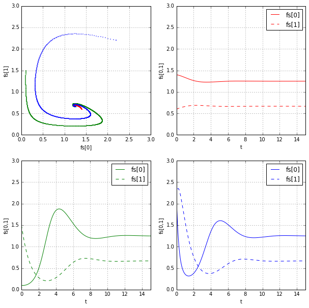

[joyofdata.de](http://blog.joyofdata.de) / [@joyofdata](https://www.twitter.com/joyofdata) / Raffael Vogler

---
# Tool Set for Playing with ODEs

```python
%matplotlib inline

%load_ext autoreload
%autoreload 2

from diffeq import *
```


```python
def f1(y, t):
    return y + t**2.0

plot_ode_solution(f1, ic=(1,-1), c=None,
    slope_field_step=(.3,.3), t_lim=(-3,3), y_lim=(-3,3))
```


```python
def f2(y):
    return (y+10**-3) * math.sin(math.pi/2 * y+10**-3)

plot_ode_solution(f2, ic=(2,-3), c=None,
    slope_field_step=(.5,.5), t_lim=(-3,3), y_lim=(-3,3))
```


```python
def f3(y, c):
    return c - y**2

plot_ode_solution(f3, ic=(1,2), c=1,
    slope_field_step=(.5,.5), t_lim=(-3,3), y_lim=(-3,3), t_del=1e-3)

plot_parameterized_phase_lines(f3, range(-10,10), (-5,5))
```

    /usr/local/lib/python3.4/dist-packages/scipy/integrate/odepack.py:156: ODEintWarning: Excess work done on this call (perhaps wrong Dfun type). Run with full_output = 1 to get quantitative information.
      warnings.warn(warning_msg, ODEintWarning)


```python
k = 20
m = 2

def harmonic_oscillator(ys, t):
    return [
        ys[1],
        -k/m*ys[0]
    ]

plot_solution_and_components(harmonic_oscillator, 
    ics=[(0,[1,0])], 
    args=None, 
    t_lim=(0,10), y_lims=[(-5,5),(-5,5)], t_del=0.001)
```


```python
a = 2
b = 1.2
c = 1
d = 0.9

def predator_prey(ys, t):
    return [
        a*ys[0] - b*ys[0]*ys[1],
        -c*ys[1] + d*ys[0]*ys[1]
    ]

plot_solution_and_components(predator_prey, 
    ics=[(10,[1,0.5]), (10,[1.1,0.6]), (10,[0.9,0.7])], 
    args=None, 
    t_lim=(0,20), y_lims=[(0,4),(0,4.5)], t_del=0.01)
```


```python
def predator_prey2(ys, t):
    return [
        2*ys[0]*(1-ys[0]/2.5)-1.5*ys[0]*ys[1],
        -ys[1]+0.8*ys[0]*ys[1]
    ]

plot_solution_and_components(predator_prey2, 
    ics=[(0,[1.4,0.6]),(0,[0.1,1.5]),(0,[2.2,2.2])], 
    args=None, 
    t_lim=(0,15), y_lims=[(0,3),(0,3)], t_del=0.01)
```




